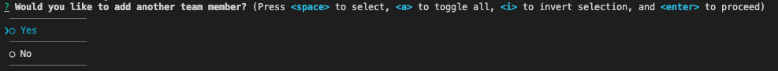
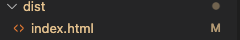
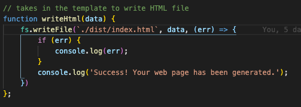
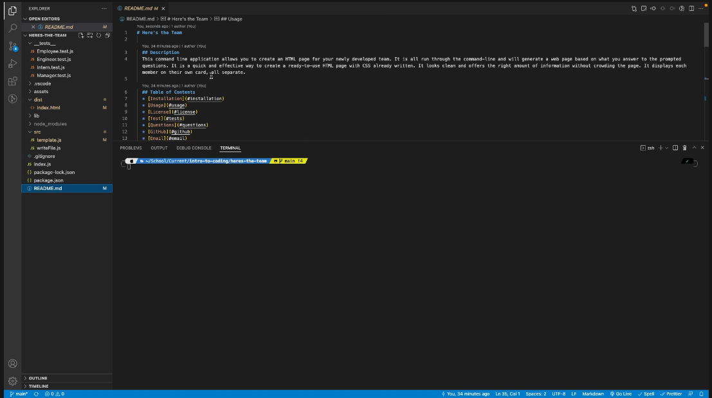
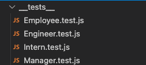

# Here's the Team
          
  ## Description
  This command line application allows you to create an HTML page for your newly developed team. It is all run through the command-line and will generate a web page based on what you answer to the prompted questions. It is a quick and effective way to create a ready-to-use HTML page with CSS already written. It looks clean and offers the right amount of information without crowding the page. It displays each member on their own card, all separate.
  
  ## Table of Contents
  * [Installation](#installation)
  * [Usage](#usage)
  * [License](#license)
  * [Test](#tests)
  * [Questions](#questions)
  * [GitHub](#github)
  * [Email](#email)
  
  ## Installation 
  To install, simply clone the repository into your bash or shell, and run an 'npm i' to download the required dependencies. You will then be ready to use the Team Generated!
  
  ## Usage 
  To start the application, run 'node index' or 'node index.js' in your command-line. It will then ask you a series of team related questions. After each entry it will ask you if you want ta add another employee, if you respond 'yes' it will start the questions over. If you respond 'no', however, it will then generate the HTML page with all of your team info. 
  
  
  Once complete, it will notify you in the console "Success! Your web page has been generated."

  

  It will always render the HTML into the same file, "dist/index.html", so be careful! It will override your previous entry every time you create a new page.

  

  If you would like to change the location in which it renders, simply change the first parameter in the fs.writeToFile(). It is located in the 'src' directory.

  

## Video on Usage
Click the video to see a tutorial walk-through on the app.

  ## License
  ### Badges
  
  ### Links to licenses
  https://opensource.org/licenses/MIT

  ## Tests 
  The tests are written to insure that the classes, as well as their methods are working properly. They are in the __tests__ directory and there is one for a base Employee, a Manager, an Engineer and an Intern. This application uses jest, a node.js dependency, to run its tests. To invoke the testing, type 'npm run test' into the command line. This is demonstrated in the tutorial video in the  [Usage](#usage) section.

  
  ## Questions
  If you have any questions, feel free to reach out and contact me via email.
  ### Email
  kieranhan1999@gmail.com
  ### GitHub
  www.github.com/KieranHannagan
  

  